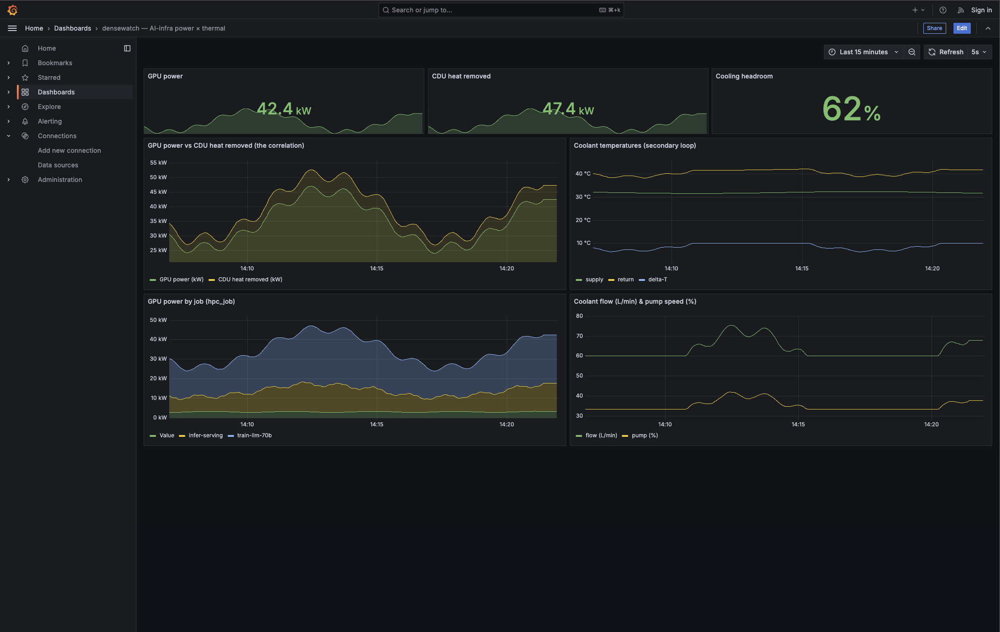

# densewatch

**Open-source observability that correlates GPU workload ↔ rack power ↔ liquid-cooling thermals for high-density AI infrastructure** — the integrated power+thermal view that today exists only in proprietary DCIM, across heterogeneous CDUs (Redfish *and* Modbus/SNMP).



> **Status: M3 — correlation.** `make demo` runs the full stack incl. `densewatch-correlate`, which joins GPU jobs → racks → power → CDUs (per-rack power density, cooling headroom, job→rack→CDU attribution). M1 exporter + probe and M2 dashboards done. See [docs/ROADMAP.md](docs/ROADMAP.md).

**What it does that no open-source tool does today:**

- **One exporter, heterogeneous CDUs** — scrapes the Redfish `CoolingUnit` schema (DMTF DSP2064) *and* falls back to **Modbus** for the many CDUs that don't speak Redfish, into a single metric schema.
- **A conformance probe** — point it at a CDU and it reports which DSP2064 properties the unit *actually* serves (vendors advertise "Redfish"; few document the cooling schema).
- **GPU-job ↔ power ↔ cooling correlation** — the integrated view that otherwise lives only in closed, expensive DCIM.

## Why

`dcgm-exporter` and commercial GPU SaaS (e.g. Datadog) stop at the GPU device. The generic Redfish exporters stop at the server chassis. **Nobody open joins GPU jobs to rack power and CDU cooling.** That join — plus coverage of CDUs that speak Modbus/SNMP rather than Redfish — is densewatch.

## Quickstart (no hardware needed)

```sh
make sim
#   redfish  CoolingUnit sim  →  http://localhost:5000/redfish/v1/ThermalEquipment/CDUs/1
#   dcgm     metrics sim      →  http://localhost:9400/metrics
#   modbus   CDU sim (FC3/4)  →  modbus-tcp://localhost:5020  (13 input registers)
```

In another shell:

```sh
# live CDU coolant telemetry (DSP2064 CoolingUnit schema)
curl -s localhost:5000/redfish/v1/ThermalEquipment/CDUs/1/SecondaryCoolantConnectors/1 | python3 -m json.tool

# GPU power with the hpc_job correlation key
curl -s localhost:9400/metrics | grep DCGM_FI_DEV_POWER_USAGE | head
```

The simulator drives GPU power **and** CDU heat load from one shared workload signal, so the two telemetry streams genuinely correlate — exactly what the correlation engine (M3) will exploit. Heat balance holds: `HeatRemovedkW ≈ FlowLitersPerMinute × ΔT × 0.0698`.

### Run the exporter (M1)

With the simulator running, scrape a Redfish CDU **and** a Modbus CDU into one schema:

```sh
make exporter   # densewatch-cdu → http://localhost:9839/metrics
curl -s localhost:9839/metrics | grep heat_removed_kw
#   densewatch_cdu_heat_removed_kw{cdu="1",protocol="redfish"} 44.9
#   densewatch_cdu_heat_removed_kw{cdu="localhost:5020",protocol="modbus"} 44.9
```

Same metric, two wire protocols — that normalization across heterogeneous CDUs is the point.

### Probe a CDU's Redfish conformance (M1)

Vendors advertise "Redfish" but rarely document DSP2064 `CoolingUnit` conformance. Check what a unit *actually* serves before trusting a datasheet:

```sh
go run ./exporters/cdu probe http://localhost:5000/redfish/v1
#   Coverage: 16/16 checked DSP2064 CoolingUnit properties served.
#   Verdict: GOOD — densewatch-cdu's Redfish path is fully supported on this unit.
```

It accepts a service root, `ThermalEquipment`, or `CoolingUnit` URL and navigates down; a non-Redfish target gets a "fall back to a Modbus/SNMP profile" verdict.

### Full stack with dashboards (M2)

```sh
make demo   # docker compose: sim → densewatch-cdu → VictoriaMetrics → Grafana
```

Open **http://localhost:3000** for the *"AI-infra power × thermal"* dashboard — GPU power next to CDU heat removed (the correlation), coolant temps, per-job GPU power, flow/pump. Tear down with `make demo-down`. Details in [deploy/](deploy/).

## Layout

| Path | What | Milestone |
|---|---|---|
| `simulator/` | Zero-hardware feeds: Redfish CDU + dcgm + Modbus-TCP CDU (SNMP PDU next) | **M0** |
| `exporters/cdu/` | `densewatch-cdu`: Redfish + Modbus CDU → unified schema ✅ (SNMP + conformance probe next) | **M1** |
| `correlation/` | `densewatch-correlate`: job → rack → power → CDU topology join ✅ (NetBox backend next) | **M3** |
| `dashboards/` | Opinionated Grafana JSON | M3 |
| `deploy/` | docker-compose: full stack + Grafana dashboard ✅ (Helm later) | **M2** |

## How we're different

- **vs `dcgm-exporter` / Datadog GPU Monitoring** — they stop at the GPU device; densewatch adds the facility half (rack power + CDU cooling) and the join.
- **vs commercial DCIM-for-AI** (ProphetStor, Vertiv, Schneider, Sunbird, Nlyte) — closed and control-coupled; densewatch is open, read-only, operator-led.
- **vs DMTF Redfish-Tacklebox** — a CLI that reads the schema; densewatch is the productized exporter + correlation, with a Modbus/SNMP fallback for the many CDUs that don't speak Redfish.

## Develop

```sh
make test   # unit tests (telemetry physics + job mapping)
make vet    # go vet
make build  # → bin/densewatch-sim
```

## License

Apache-2.0 © 2026 ZNTRAQ.
